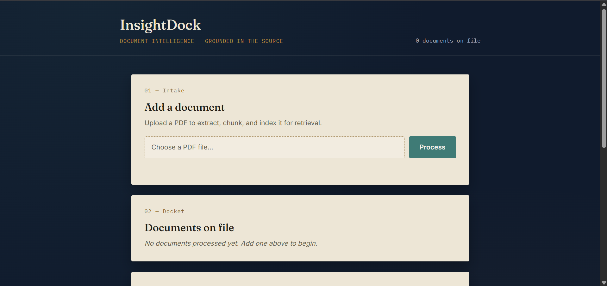
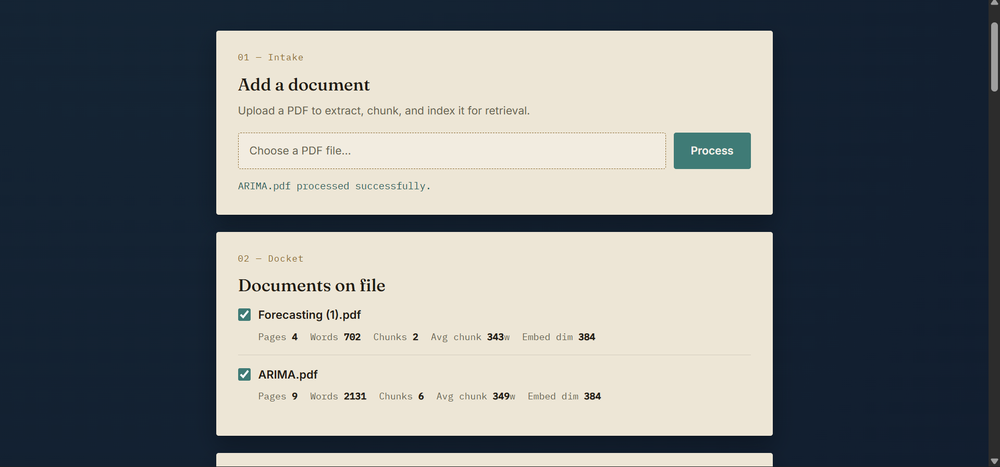
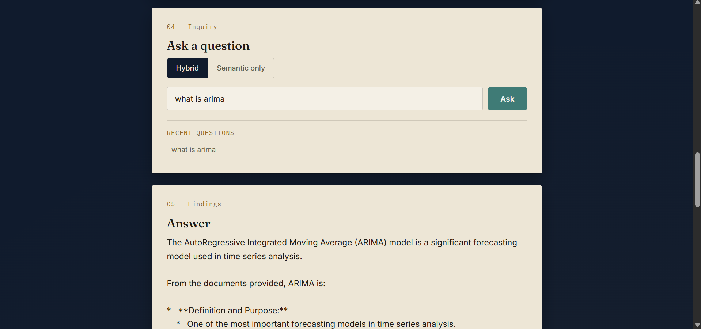
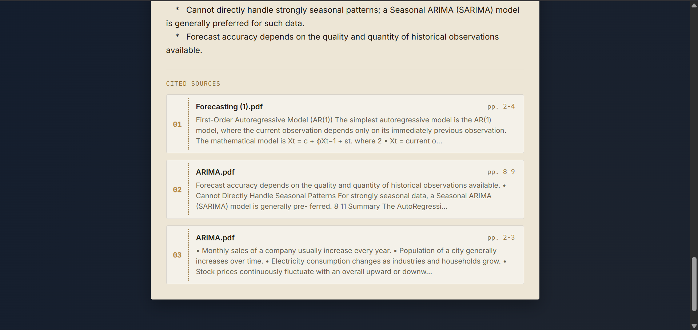
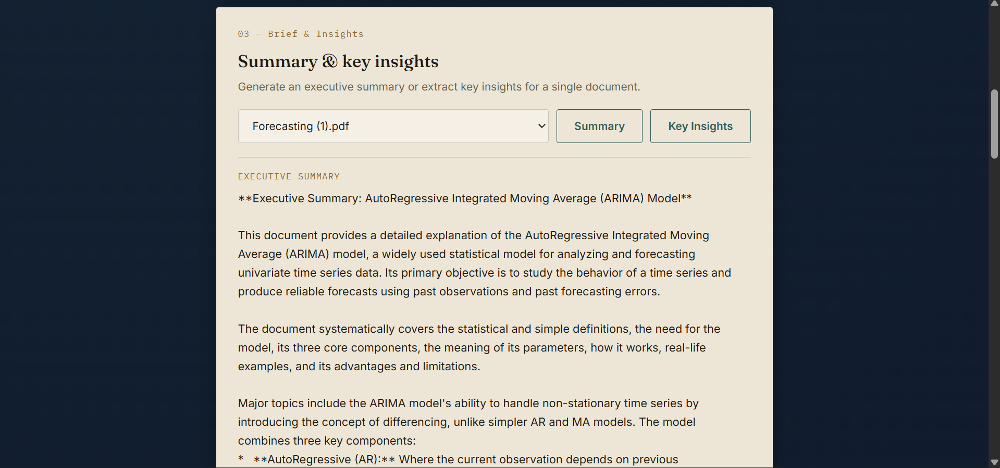
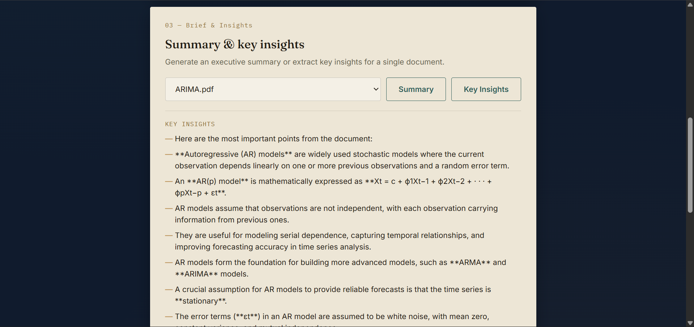

# InsightDock  
    

An end-to-end Retrieval-Augmented Generation (RAG) application that allows users to upload PDF documents, build semantic vector indexes, and interact with them using natural language.

The application combines Natural Language Processing (NLP), semantic search, vector embeddings, and Retrieval-Augmented Generation (RAG) to extract information from PDF documents and answer questions with grounded responses.

### Live Demo

**Application:** https://insightdock-8d82.onrender.com/

---
## Demo

 Watch the application in action:
<video src="https://github.com/user-attachments/assets/cb639d89-0853-4e9e-b73f-f393fb11355a" width="100%" controls autoplay loop muted playsinline></video>


---
## Features

* Upload and manage multiple PDF documents in one session
* Automatic text extraction using PyMuPDF
* Intelligent document chunking
* Sentence Transformer embeddings
* FAISS vector search (semantic)
* BM25 keyword search, fused with semantic search via Reciprocal Rank Fusion (hybrid mode)
* Cross-document retrieval — search within one document or across all uploaded documents
* Retrieval-Augmented Question Answering (RAG) with per-source, per-document citations
* Executive Summary generation, per document
* Key Insights extraction, per document
* Source attribution with filename and page references
* Interactive web interface (FastAPI + vanilla JS), with in-session question history
* Cached document processing
* Document statistics dashboard
* Dockerized for consistent, reproducible deployment
---
---
## Screenshots

### Dashboard


### Document Processing



---

### Question Answering




---

### Executive Summary



---

### Key Insights



---

## Project Highlights

- Built an end-to-end NLP + RAG pipeline for PDF question answering.
- Uses Sentence Transformers to generate semantic embeddings.
- Stores vector representations using FAISS for efficient similarity search.
- Generates grounded answers with page-level source attribution.
- Includes automated executive summaries and document key insights.
- Interactive web interface (FastAPI + vanilla JS) with document statistics, cached processing, and in-session question history.
- Packaged with Docker for consistent deployment across environments.

---


## Multi-Document Search & Retrieval

InsightDock supports uploading and querying multiple documents in the same session:

- Each document is processed and stored independently — its own chunk file, embedding file, and FAISS index, named by a hash of its content so re-uploads are cached automatically.
- Queries can target a single document or be run across every uploaded document at once; retrieved chunks are merged by relevance and tagged with their source filename.

Retrieval runs in one of two modes:

- **Semantic search** — FAISS similarity search over sentence embeddings.
- **Hybrid search** — semantic search combined with BM25 keyword search, merged using **Reciprocal Rank Fusion (RRF)**. RRF combines the two rankings by rank position rather than raw score, since FAISS distances and BM25 scores aren't on comparable scales. This catches exact terms (numbers, names, acronyms) that pure semantic search can miss.

**Known limitation:** answer confidence scoring is currently only shown in semantic mode, since BM25-selected sources don't have a FAISS distance to score against.
---


## API

InsightDock is served as a FastAPI application with a REST API and a vanilla JS frontend, migrated from an earlier Streamlit prototype.

| Endpoint | Method | Description |
|---|---|---|
| `/` | GET | Serves the frontend |
| `/upload` | POST | Upload and process a PDF |
| `/documents` | GET | List processed documents with stats |
| `/query` | POST | Ask a question across one or more documents |
| `/summary/{stem}` | GET | Generate an executive summary for a document |
| `/insights/{stem}` | GET | Extract key insights for a document |

Interactive API docs are auto-generated at `/docs`.
---


## Docker

The application is packaged with Docker for consistent deployment.

**Build the image:**
```bash
docker build -t insightdock .
```

**Run the container:**
```bash
docker run -p 8000:8000 --env-file .env insightdock
```

Then open `http://localhost:8000` in your browser. The embedding model is pre-downloaded at build time, so there's no cold-start delay on first request.
---
## Tech Stack

* Python
* FastAPI
* Uvicorn
* Docker
* Vanilla JavaScript, HTML, CSS (frontend)
* Google Gemini 2.5 Flash
* Sentence Transformers
* Hugging Face Transformers
* FAISS
* rank-bm25
* PyMuPDF
* NumPy
* JSON

---

## System Architecture

```
PDF Upload
      │
      ▼
Text Extraction
      │
      ▼
Sentence Chunking
      │
      ▼
Embedding Generation
      │
      ▼
FAISS Vector Index
      │
      ▼
Semantic Search
      │
      ▼
Gemini RAG Response
```

---

## Repository Structure

```
data/
    reports/
    processed/
    embeddings/

models/

src/
    pdf_loader.py
    chunker.py
    embeddings.py
    vector_store.py
    rag.py
    executive_summary.py
    key_points.py
    paths.py
    registry.py
    stats.py

static/
    index.html
    app.js
    style.css

config/
main.py
requirements.txt
```

---

## Installation

Clone the repository

```bash
git clone https://github.com/Mansha-Khod/InsightDock.git
cd InsightDock
```

Install dependencies

```bash
pip install -r requirements.txt
```

Create a `.env` file

```text
GEMINI_API_KEY=YOUR_API_KEY
```

Run the application

```bash
uvicorn main:app --reload
```

Then open `http://127.0.0.1:8000` in your browser.

**Or, run with Docker instead** (no local Python environment needed):
```bash
docker build -t insightdock .
docker run -p 8000:8000 --env-file .env insightdock
```
---

## Example Workflow

1. Upload a PDF document.
2. The application extracts text.
3. Text is divided into semantic chunks.
4. Embeddings are generated.
5. A FAISS vector index is created.
6. Ask natural language questions about the document.
7. Generate an executive summary.
8. Extract key insights.

---

## Future Improvements

- OCR support for scanned PDFs
- True cross-document summarization (currently summaries and key insights run per-document, not synthesized across documents)
- Citation highlighting inside documents
- Conversational memory
- Metadata filtering
- Local LLM support (Llama, Mistral)

---

## License

Distributed under the MIT License. See `LICENSE` for more details.

 **Note**

The live demo uses the Gemini API. On the free tier, executive summaries and key insights consume API quota and may become temporarily unavailable after the daily request limit is reached. In production, these features can be powered by local summarization models (such as BART or T5) or alternative LLM providers.

